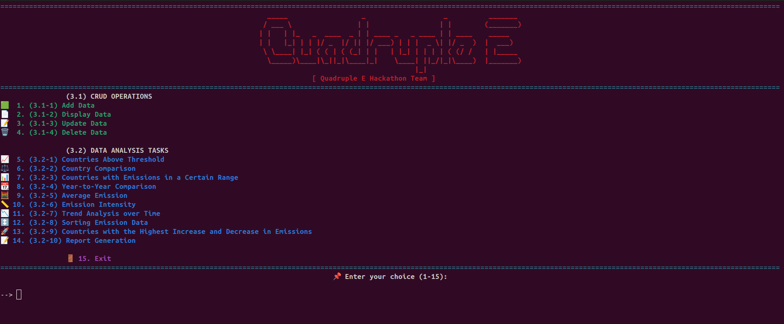

🌍 CO₂ Emissions Data Analysis Tool
===================================

KTÜ Software Engineering Hackathon Projesi
------------------------

Bu proje, ülkelerin yıllara göre karbondioksit (CO₂) salım verilerini analiz etmeyi amaçlayan konsol tabanlı bir analiz aracıdır. CSV dosyalarından alınan verilerle çeşitli karşılaştırmalar, trend analizleri ve raporlar oluşturabilir, sonuçları grafiksel olarak görüntüleyebilirsiniz.

📁 Klasör Yapısı
----------------

    project/
    ├── hackathon_data/
    │   ├── annual-co2-emissions-per-country.csv
    │   └── population.csv
    ├── utils/
    │   ├── average_emission.py
    │   ├── countries_above_threshold.py
    │   ├── countries_with_emissions_in_a_certain_range.py
    │   ├── country_comparison.py
    │   ├── dataProcess.py
    │   ├── emission_intensity.py
    │   ├── general.py
    │   ├── logger.py
    │   ├── max_increasing_decreasing.py
    │   ├── menu.py
    │   ├── report_generation.py
    │   ├── sorting_emmision.py
    │   ├── trendanalysis.py
    │   └── year_to_comparison.py
    ├── main.py
    └── README.md
    

🚀 Kurulum ve Çalıştırma
------------------------

1.  Python 3 kurulu olmalıdır.
2.  Gerekli kütüphaneleri yükleyin:
    
        pip install -r requirements.txt
    
3.  Uygulamayı başlatın:
    
        python main.py
    

🔧 Özellikler
-------------

### 🔢 Veri İşlemleri

Verileri kolayca **ekleyebilir**, **listeleyebilir**, **güncelleyebilir** ve **silebilir**siniz.

Bunların tamamı `dataProcess.py` dosyasında yönetilir.

### 📊 Veri Analizi Modülleri

**Eşik Üstü Ülkeler**

Belirli bir CO₂ değeri üzerindeki ülkeleri listeler

`countries_above_threshold.py`

**İki Ülke Karşılaştırma**

Seçilen yılda iki ülkenin CO₂ salımını karşılaştırır

`country_comparison.py`

**Belirli Aralıkta Ülkeler**

Belirli bir yıl ve salım aralığına göre ülkeleri listeler

`countries_with_emissions_in_a_certain_range.py`

**Ortalama CO₂ Salımı**

Bir ülkenin yıllara göre ortalama CO₂ salımı

`average_emission.py`

**Kişi Başı CO₂**

Nüfusa göre kişi başı CO₂ salımı

`emission_intensity.py`

**Trend Analizi**

Artış/azalış eğilimlerini analiz eder

`trendanalysis.py`

**Sıralama & Grafik**

Verileri sıralayıp grafikler üretir

`sorting_emmision.py`

**Değişim Tespiti**

Son 10 yıldaki maksimum artış/azalışları bulur

`max_increasing_decreasing.py`

**Yıllar Arası Karşılaştırma**

Farklı iki yıl arasındaki salım farklarını gösterir

`year_to_comparison.py`

**Rapor Oluşturma**

Tam kapsamlı analiz raporu üretir

`report_generation.py`

📋 Menü Sistemi
---------------

Program, kullanıcı dostu bir **menü sistemi** ile çalışır. Kullanıcılar menüden istediği işlemi seçerek analizleri başlatabilir.

📘 Örnek Kullanım
-----------------

1.  Program başlatılır.
2.  Menüden **"6. İki ülkenin salım karşılaştırması"** seçilir.
3.  Kullanıcıdan iki ülke ve yıl bilgisi alınır.
4.  Seçilen ülkelerin CO₂ salım miktarları grafikle gösterilir.

🧱 Kullanılan Kütüphaneler
--------------------------

*   `matplotlib` – Grafik oluşturma
*   `csv` – CSV verilerini işleme
*   `os`, `sys` – Konsol işlemleri
*   `input()` – Kullanıcı etkileşimi
*   `utils/logger.py` – Renkli konsol çıktıları için özel logger

📞 İletişim
-----------

**Proje Sahibi:** Quadruple E Team
